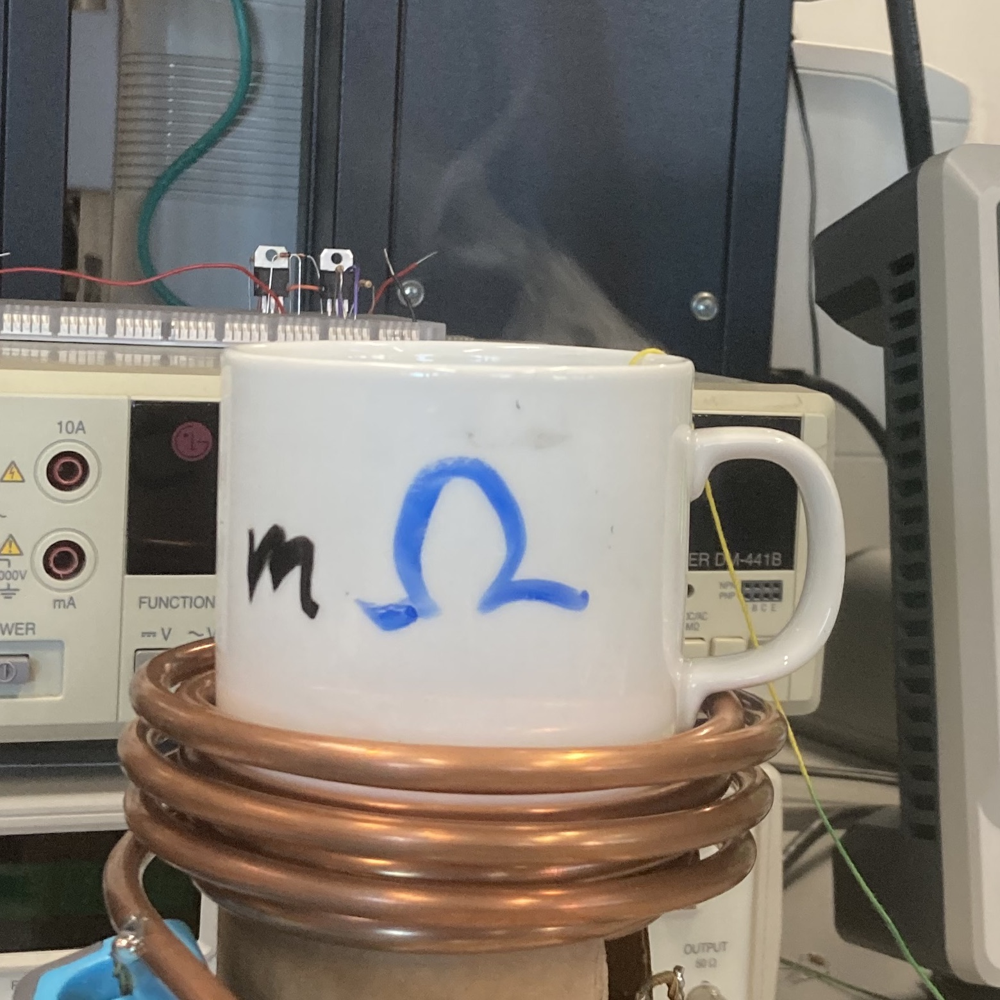

# Induction heater

Abstract: A single-mug induction heater was designed, simulated, and constructed using common electronic components and DC power supplies. The heater creates an alternating magnetic field in the vicinity of the target mug, which is transformed into thermal energy by eddy currents in a high-permeability material placed inside the mug. The heater utilizes zero-current switching and a dual-resonant load design, allowing for high currents to flow through the heating coil, with low power consumption during operation.
